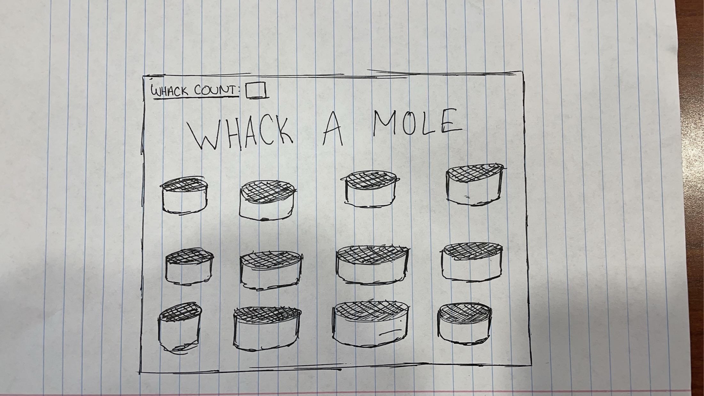
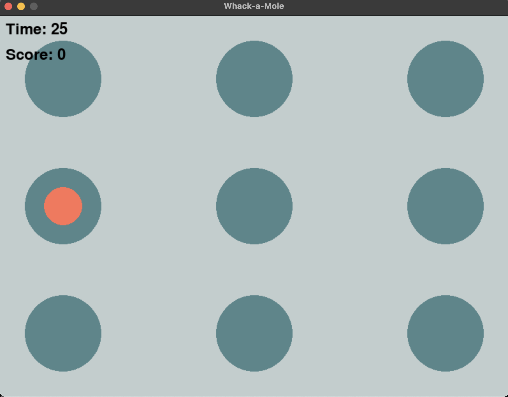

:warning: Everything between << >> needs to be replaced (remove << >> after replacing)

# << Project Title >>
## CS110 Final Project  << Fall 2023 >>

## Team Members

- Shihab Delwar
- Yanniah Boyd
***

## Project Description

- Overall, our idea is going to be a digital form of whack a mole where an object is going to be appearing, disappearing, and reappearing at various coordinates of the display where the 9 holes are placed for the game. The objective of the game would be to click on as many appearing objects as possible in a given amount of time. The number of "moles" whacked is going to be tracked and at the end the user will be able to see how many "moles" they've whacked in the given period of time. The timer in the top left corner counts down the number of secodns remaining and the tracker in the top left tracks the total number of "moles" that have been whacked so far. 

***    

## GUI Design

### Initial Design

### Final Design

## Program Design

### Features

1. Timer that counts down preset in the top left corner of the display.
2. Whack tracker that counts the number of moles whacked in the top left corner of the display.
3. Starter page that starts the program when clicked.
4. Final Score Page after the program runs that congratulates the player and tells them their score.
5. "Moles" that appear and disappear and then reappear when clicked on.

### Classes

- Mole
    - Creates the mole object that is used throughout the program. Includes function definitions that change whether the mole is shown or hidden depending on if the mole was clicked on.
- WhackAMoleGame
    - Initializes the code that allows for the program to run. Incorporates a function that calculates whether the point of the player's click is within the radius of the mole when it is showing on the display. Handles the pygame events including quitting the program and what to do when the mousebutton is pressed down. Has a function that increases the score of the player when a mole is efficiently clicked on. Has a function that draws the starter screen that says "Click To Play" that has to be pressed for the game to start. Has a function that draws the final score page that states the score of the player at the end of the game and congratulates the player. Runs the main loop function of the program that allows for the entire program to run. 

## ATP

